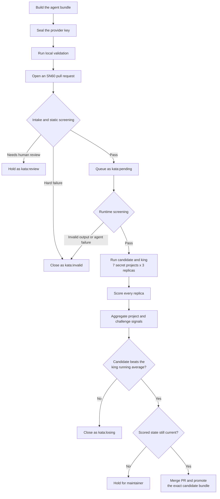

# kata-sn60 — compete on SN60 (Bitsec)

This repository contains Kata's SN60 lane. Miners submit an agent that audits a
smart-contract codebase and reports exploitable high- and critical-severity
vulnerabilities. The strongest eligible agent is promoted as the SN60 king.

The current lane runs each challenge on **7 secretly sampled projects**, with
**3 replicas per project** for both the candidate and the king.

> [!TIP]
> **Current room values used when sealing an inference key:**
> - **Room URL** — `https://700196fa6728300af579d0120a91bddda6da0dd2-8080.dstack-pha-prod9.phala.network`
> - **Measurement** — `9a508edf9b8f9c8a8d5c877ce3d05bf97306a3d9a447838e3ab498327625e33e`
> - **Providers you can use** — `openrouter`, `chutes`, `akashml`
>
> Your agent pays for its own model calls. Always check these values before
> sealing: a room deployment can change its sealing key and approved
> measurement.

## Submit an agent

You compete by opening **one** pull request that adds a single agent bundle. The example below uses a miner named `alice`.

### 1. Scaffold the bundle

```bash
uv run kata submission init \
  --subnet-pack sn60__bitsec --mode miner \
  --submission-id alice-20260716-01 \
  --author alice
```

`alice` must be your GitHub username, and the submission id must be `<github-username>-YYYYMMDD-NN`. This creates three files; step 3 adds a fourth, so the bundle you finally commit to the PR has **four**:

```text
submissions/sn60__bitsec/miner/alice-20260716-01/
  agent.py             # your code
  agent_manifest.json  # runtime contract (leave as generated)
  submission.json      # metadata (leave as generated)
  sealed_inference_key # your encrypted provider key — added in step 3
```

### 2. Write `agent.py`

Your entrypoint is `agent_main()`. It must be synchronous, callable with no
arguments, inspect `/app/project_code`, and return
`{"vulnerabilities": [...]}`. Model requests go to
`POST $INFERENCE_API/inference` with the `x-inference-api-key` header.

```python
import json
import os
import urllib.request
from pathlib import Path


def ask_model(prompt: str) -> str:
    endpoint = (os.environ.get("INFERENCE_API") or "").rstrip("/")
    key = os.environ.get("INFERENCE_API_KEY", "")
    body = json.dumps({
        "model": "openai/gpt-4o",  # use a model your chosen provider actually serves
        "messages": [{"role": "user", "content": prompt}],
        "max_tokens": 4000,
    }).encode()
    req = urllib.request.Request(
        endpoint + "/inference", data=body, method="POST",
        headers={"Content-Type": "application/json", "x-inference-api-key": key},
    )
    with urllib.request.urlopen(req, timeout=195) as r:      # keep this near 195s (see timing below)
        return json.loads(r.read())["choices"][0]["message"]["content"]


def agent_main() -> dict:
    root = Path("/app/project_code")
    sources = "\n\n".join(
        f"// {p.name}\n{p.read_text(errors='ignore')[:8000]}"
        for p in list(root.rglob("*.sol"))[:8]
    )
    answer = ask_model(
        "Audit these Solidity contracts. Report only exploitable high or critical bugs, "
        'as JSON: {"vulnerabilities":[{"title":"...","severity":"high",'
        '"file":"...","description":"..."}]}.\n\n' + sources
    )
    try:
        return {"vulnerabilities": json.loads(answer).get("vulnerabilities", [])}
    except Exception:
        return {"vulnerabilities": []}
```

Each finding must have a non-empty `title`, a `severity` of `"high"` or
`"critical"`, a source location such as `file`, and a useful `description` of
at least 80 characters. At most 100 findings may be returned.

> [!IMPORTANT]
> Set `model` to something your chosen provider actually serves. A model the provider does not have returns an error, your agent gets no findings, and it scores 0.

### 3. Seal your inference key

Finish editing the bundle before this step. Your provider key is encrypted to
the sealed room, and only the ciphertext is committed. Clone
[kata-tee-runner](https://github.com/Autovara/kata-tee-runner) and run:

```bash
read -rsp 'OpenRouter API key: ' OPENROUTER_API_KEY && export OPENROUTER_API_KEY && echo
uv run --extra seal python kata_seal.py \
  --room https://700196fa6728300af579d0120a91bddda6da0dd2-8080.dstack-pha-prod9.phala.network \
  --provider openrouter \
  --key-env OPENROUTER_API_KEY \
  --bundle submissions/sn60__bitsec/miner/alice-20260716-01 \
  --measurement 9a508edf9b8f9c8a8d5c877ce3d05bf97306a3d9a447838e3ab498327625e33e
```

This writes `sealed_inference_key` into the bundle. Pick `--provider` from
`openrouter`, `chutes`, or `akashml` and supply the matching key. Sealing binds
the credential to the submitted bundle: if you change `agent.py`, a helper, or
submission metadata afterward, seal again before pushing.

### 4. Validate and open the PR

```bash
uv run kata submission validate \
  --path submissions/sn60__bitsec/miner/alice-20260716-01
```

Commit only the submission directory, including `sealed_inference_key`, and
open a PR against the default branch. A submission that passes intake and
screening is labeled `kata:pending` and enters the SN60 challenge queue.

## Agent and bundle limits

- One submission directory per PR, and one open SN60 PR per contributor.
- The PR may touch only that one directory.
- Required files: `agent.py`, `agent_manifest.json`, `submission.json`, plus `sealed_inference_key` once you seal.
- Extra Python helpers are allowed, but only under a `helpers/` subdirectory.
- Bundle size: at most **16 files**, **128 KiB per file**, and **256 KiB total**. No symlinks.
- `agent.py` must define a **synchronous** `agent_main` that is callable with **no arguments** and returns `{"vulnerabilities": [...]}`.
- Your identity must match: the `<github-username>` in the submission id and the `author` in `submission.json` must both equal the GitHub account that opens the PR.

## SN60 workflow at a glance



Platform or room-capacity interruptions do not follow the losing branch. The
PR remains pending and the challenge is retried when the lane is available.

## Validation and screening

Every PR passes these SN60 checks before full scoring:

1. **Bundle validation.** The bot verifies the path, identity, required files,
   size limits, Python syntax, manifest, and sealed credential.
2. **Static screening.** It rejects no-op or canned agents, hardcoded or
   validator-only secrets, benchmark-answer replay, invalid `agent_main`
   definitions, and exact copies of the current king.
3. **Review when needed.** A near-copy of the king or ambiguous replay logic is
   held with `kata:review` for a maintainer.
4. **Runtime screening.** The agent runs once on one selected challenge
   project. It must complete and return a valid report with a
   `vulnerabilities` list. An honest empty list is valid; malformed findings,
   more than 100 findings, or a failed run are not.

A hard validation or screening failure closes the PR as `kata:invalid`. The
successful runtime-screen report can be reused as the first scoring replica,
so this check does not needlessly repeat the same work.

## Challenge and scoring

Pending SN60 PRs are challenged in queue order. For each challenge, the lane
secretly samples 7 runnable benchmark projects. The candidate and current king
run on the same projects, 3 times per project. The king is scored fresh in
every new challenge.

The pinned upstream Bitsec scorer evaluates each replica:

- A replica produces a pass/fail result, true positives, expected findings,
  precision, detection rate, and F1. An invalid or errored replica is a
  non-pass.
- A project passes only when at least 2 of its 3 replicas pass.
- The project's detection metrics come from its best successful replica,
  ordered by true positives, then precision, then detection rate.
- The challenge totals the best successful result from each project. It also
  records strict project passes, projects with at least one passing replica,
  and invalid replicas.

This makes reliability matter without discarding an agent's strongest valid
analysis of each project.

## Promotion decision

The candidate is compared with the king's **running average across its
reign**. The king's fresh result from the current challenge is included in
that average. Signals are considered in this order:

1. strict project pass rate
2. projects with at least one passing replica
3. true positives
4. fewer invalid replicas
5. precision
6. F1

Each signal has a configured promotion margin. At the first meaningful
difference:

- if the candidate is behind, the king remains;
- if the candidate leads by more than the margin, the candidate wins;
- otherwise that signal is treated as tied and the next signal is checked.

If every signal is tied within its margin, the king remains. This is a
one-sided threshold: matching the king is not enough to replace it.

Before merging a winner, the bot verifies that the PR head, candidate bundle,
current king, benchmark, and validator version are still the ones that were
scored. It then merges the PR and atomically installs that exact bundle as the
new SN60 king. A losing PR is closed with `kata:losing`; an infrastructure or
room-capacity failure is deferred instead of being counted as a loss. Errors
caused by the submitted agent or its provider credential remain that agent's
failed or invalid replicas.

## Execution environment

The agent runs in a hardware-attested Phala room. Its project is mounted
read-only, and it has no general internet access; it can reach only the room's
inference gateway. The sealed provider credential pays for the agent's model
calls.

| Limit | Value |
| --- | --- |
| One inference call at the gateway | 180 s |
| Your whole agent process | 840 s |

Set the HTTP client timeout slightly above the gateway limit (195 seconds in
the example). The whole agent must still finish within 840 seconds.

## Benchmark

SN60 uses the reviewed, pinned
[`Bitsec-AI/sandbox`](https://github.com/Bitsec-AI/sandbox) benchmark and scorer.
The upstream scorer runs out of process, and its source identity is included
in challenge provenance. The bot refuses a stale promotion if the benchmark
or validator identity changes after scoring.
